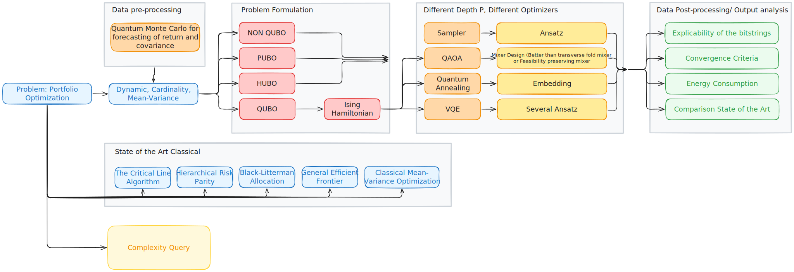

# FFQuartic Project

A Quantum framework for dynamic portfolio optimization with Team FFQuartic ([J.-T. Lu](https://github.com/mothorchids), A. Abbassi and J.-N. Lu) during the Quantum Computing Hackathon organized by IBM, City of London and NayaOne, October 2025.

<p align="center">
  
</p>

```
├── _FFQuartic.txt   # Main notebook for submission
├── _README_FFQuartic.md       # This file
|
|   # All Python source files that supports the main notebook
├── utils
|        ├── database_connection.py  # connection to NayaOne datasets
|        ├── myplot.py 
|        ├── notebook_setup.sh
|        ├── portfolio_model.py
|        └── utility.py
|
├── img/ # Images for documentation and results
|   
|   # Default files
├── README_FAQ_.md
├── Getting_Started_IBM_Quantum.ipynb
├── Getting_Started_Python.ipynb
└── assets/
```
